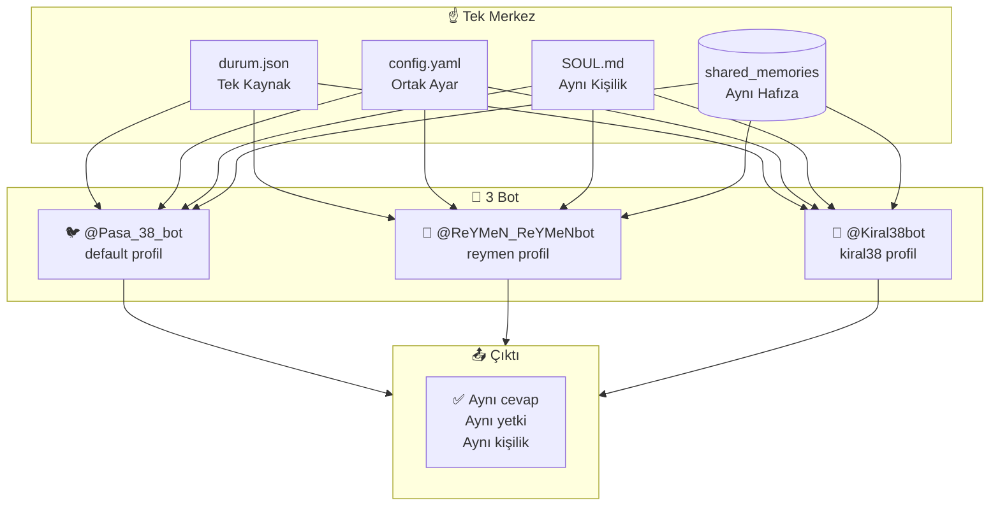
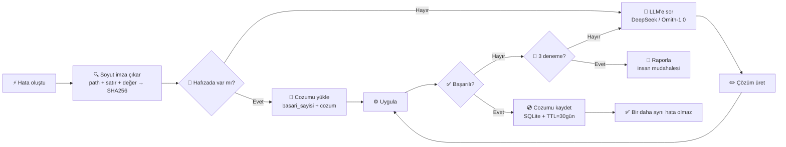

# ReYMeN Agent

> Autonomous AI agent with built-in learning loop, multi-platform messaging, plugin system, and reasoning core.

ReYMeN is a self-contained, open-source AI agent framework. It runs on its own infrastructure — no external agent libraries required. Built around a **closed learning loop**: it creates skills from experience, persists memory across sessions, and autonomously maintains its own health via proactive maintenance scripts.

## Features

### Core
- 🧠 **Beyin** — LLM provider abstraction with fallback chain (DeepSeek, xAI, OpenAI, Anthropic, Groq, local)
- 🔁 **Conversation Loop** — ReAct-style: plan → tool call → evaluate → repeat
- 🧩 **Plugin System** — 7 lifecycle hooks: `on_load`, `on_message`, `pre_llm_call`, `post_llm_call`, `on_session_start/end`, `on_unload`
- 🧪 **Reasoning Core** — Ornith-1.0 integrated for autonomous error analysis + solution logging
- 💾 **Persistent Memory** — OnceHafiza (MEMORY.md + USER.md), FTS5 session search, shared_memories symlink
- 🛠️ **Skills** — Autonomous skill creation after complex tasks, SKILL.md format

### Multi-Agent
- 👥 **3 Bot Single Center** — pasa_38, ReYMeN, kiral38 sharing one config + memory + session via `durum.json` (single source of truth)
- 🔀 **Multi-Profile** — Isolated profiles (default, reymen, kiral38) with shared session history
- 🔄 **Ortak Komut** — Unified 26-command system across all bots

### Gateway & Platforms
- 💬 **Telegram** — Full gateway with /commands, session management, SOUL.md personality
- 💬 **Discord** — py-cord based gateway, same architecture as Telegram
- 💬 **WhatsApp** — REST API gateway
- 🌐 **API Server** — OpenAI-compatible `/v1/chat/completions` endpoint
- 🔊 **Voice Mode** — Real-time voice conversations

### Tools & Extensions
- 🌍 **Web Search** — Firecrawl + DuckDuckGo + Bing fallback
- 🖼️ **Image Generation** — FAL.ai (FLUX 2 Klein 9B)
- 🎤 **TTS/STT** — Edge TTS + faster-whisper
- 🌐 **Browser Automation** — Playwright MCP
- 🔗 **MCP Support** — Both client (native MCP) and server (expose sessions via MCP)
- 📎 **@file/@url References** — Inline file/URL reading in conversations
- 🐳 **Container Sandbox** — Docker isolation (kapali/kismi/tam modes)
- 🔑 **Credential Pool** — Automatic API key rotation

### Automation & Maintenance
- ⏰ **Cron Scheduler** — Built-in cron with no_agent watchdog mode
- 🩺 **Proactive Bakim** — 8-point health check every 30min (config drift, gateway watchdog, SOUL sync, state.db prune, memory sync, weekly report, config validation, gateway health)
| 🛡️ **Startup VBS** — Reboot-proof auto-start for all bots

## Architecture

### 3 Bot — Single Center



### Reasoning Core — Closed Learning Loop



## Quick Start

```bash
# Install
git clone https://github.com/recaiozil-wq/reymen-agean.git
cd reymen-agean
uv venv
uv pip install -e ".[all]"

# Configure
cp .env.example .env
# Edit .env with your API keys

# Run
python reymen_launcher.py

# One-shot
python reymen_launcher.py -z "your question"

# Start gateway (Telegram)
hermes gateway --profile reymen
```

## Architecture

```
reymen/
├── ag/            # Gateways (Telegram, Discord, MCP Server)
├── arac/          # Tools (tool registry, executor)
├── cereyan/       # Core loop (motor, conversation_loop, broker)
├── core/          # Subsystems (orchestrator, cron, credential pool)
├── guvenlik/      # Security (file safety, container sandbox)
├── hafiza/        # Memory (session DB, OnceHafiza, vector)
├── plugin/        # Plugin system (PluginBase, PluginManager)
├── plugins/       # Installed plugins
├── scripts/       # Proactive bakim, watchdog
└── sistem/        # System (db_config, credential_persistence)
```

## Project Stats

- **694 Python files**, 231K lines of code
- **154 commits**, single developer
- **MIT License**

## License

MIT License — see [LICENSE](LICENSE) for details.
